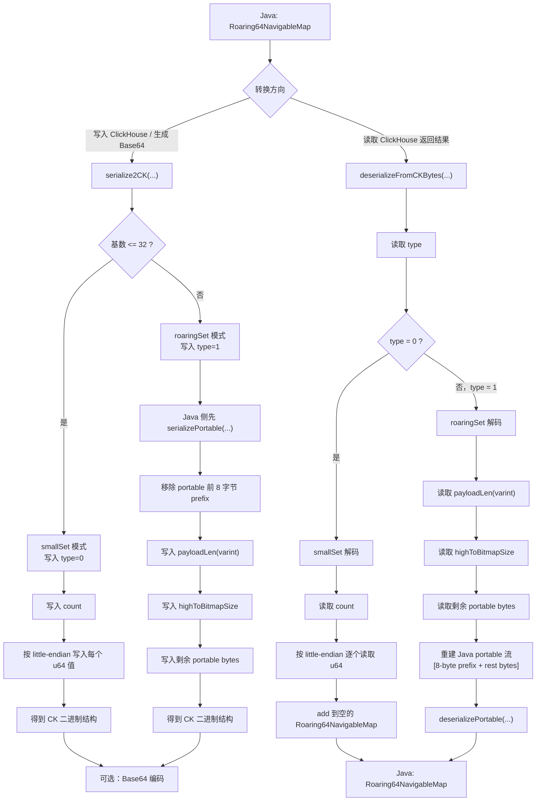
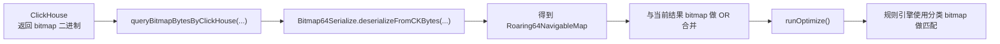

# Bitmap64Serialize：ClickHouse Bitmap 与 Java Roaring64 兼容转换说明

## 背景
在实时规则引擎中，我们需要使用 ClickHouse 返回的 bitmap 数据进行高性能规则匹配。

但 ClickHouse bitmap 的二进制结构与 Java 侧 `Roaring64NavigableMap` 的序列化协议并不完全一致，直接反序列化会失败。为了解决这个问题，项目中实现了 `Bitmap64Serialize` 组件，用于完成：

- ClickHouse bitmap 二进制结果解析
- Java `Roaring64NavigableMap` 重建
- Java bitmap 向 ClickHouse 格式的兼容写出

该组件打通了 ClickHouse bitmap 与 Java bitmap 对象之间的跨系统兼容链路，为规则引擎中的大规模分类 bitmap 匹配提供了底层支持。

核心实现文件：`src/main/java/com/glab/yd/tools/Bitmap64Serialize.java`

---

## 核心目标
`Bitmap64Serialize` 的主要目标包括：

1. 兼容 ClickHouse bitmap 的两种编码格式
    - `smallSet`（type = 0）
    - `roaringSet`（type = 1）
2. 处理跨系统二进制协议差异
    - little-endian 字节序
    - VarInt 长度字段
    - Java portable bitmap prefix 重建
3. 在 Java 侧统一还原为 `Roaring64NavigableMap`

---

## 总体流程图


---

## 在线读取链路
在规则引擎运行过程中，ClickHouse bitmap 的实际读取链路如下：



业务链路中的实际调用位置：

- `src/main/java/com/glab/yd/alarm/provider/ExternalProviders.java`
- 读取 ClickHouse bitmap 后调用 `Bitmap64Serialize.deserializeFromCKBytes(bytes)`
- 将多个批次结果 `or` 合并后再 `runOptimize()`

---

## 编码流程说明

### 1. Java 对象写出为 ClickHouse bitmap 格式
方法入口：`serialize2CK(...)`

核心逻辑如下。

#### smallSet 模式
当 bitmap 基数较小（`<= 32`）时，采用 `smallSet` 格式：

- 写入 `type = 0`
- 写入元素个数 `count`
- 逐个按 little-endian 写入 `u64`

结构如下：

```text
[type=0][count][u64][u64][u64]...
```

特点：
- 结构简单
- 小基数场景下体积更小
- 适合直接顺序读写

#### roaringSet 模式
当 bitmap 基数较大时，采用 `roaringSet` 格式：

- 写入 `type = 1`
- 写入 `payloadLen(varint)`
- 写入 `highToBitmapSize`
- Java 侧先执行 `serializePortable(...)`
- 去掉 portable 字节流前 8 字节 prefix
- 将剩余字节写入 ClickHouse 结构

结构如下：

```text
[type=1][payloadLen(varint)][highToBitmapSize][portable_bytes_without_prefix]
```

设计原因：
- ClickHouse bitmap 返回结构与 Java `Roaring64NavigableMap` 的 portable 序列不完全一致
- 需要拆出 prefix 后再组织成 ClickHouse 侧可识别的布局

---

## 解码流程说明

### 2. ClickHouse 返回结果还原为 Java 对象
方法入口：`deserializeFromCKBytes(...)`

核心逻辑如下。

### smallSet 解码
如果 `type = 0`：

- 读取 `count`
- 逐个读取 little-endian `u64`
- 依次 `add` 到空的 `Roaring64NavigableMap`

适用场景：
- 小基数 bitmap
- 结构简单，解码开销低

### roaringSet 解码
如果 `type = 1`：

- 读取 `payloadLen(varint)`
- 读取 `highToBitmapSize`
- 读取剩余 portable bytes
- 在 Java 侧重新构造完整 portable 流：
    - `8-byte prefix + rest bytes`
- 再调用 `deserializePortable(...)` 恢复成 `Roaring64NavigableMap`

这一段是整个适配流程的关键，因为 Java 反序列化依赖完整 portable 结构，而 ClickHouse 返回的内容并不是 Java 可直接消费的原始字节流。

---

## 关键兼容点

### 1. 两种 bitmap 类型兼容
组件需要同时兼容：

- `smallSet`
- `roaringSet`

因为 ClickHouse 在不同基数下会选择不同 bitmap 编码方式。

### 2. 字节序差异
ClickHouse bitmap 使用 little-endian 编码，因此在解析和写出过程中都需要显式指定：

```java
ByteBuffer.order(ByteOrder.LITTLE_ENDIAN)
```

否则会出现高低位错乱，导致还原后的 bitmap 内容不正确。

### 3. VarInt 长度字段处理
在 `roaringSet` 模式中，payload 长度使用 VarInt 编码，需要显式解析。

这个步骤的意义是：
- 正确推进 buffer 游标
- 确保后续读取 `highToBitmapSize` 与 portable bytes 时边界正确

### 4. Java portable prefix 重建
Java `Roaring64NavigableMap` 的 portable 序列与 ClickHouse 返回结构之间存在 prefix 差异：

- Java portable 流包含前 8 字节 prefix
- ClickHouse bitmap 返回时拆出了 `highToBitmapSize`
- 解码时必须重新拼回前缀，才能正常 `deserializePortable(...)`

这一点是 ClickHouse bitmap 与 Java bitmap 对象无法直接互通的核心原因之一。

---

## 关键方法一览

### Java -> ClickHouse
- `serialize2CK(...)`

### Java -> Java portable bytes
- `serialize2Java(...)`

### ClickHouse Base64 -> Java
- `deserializeFromCKBase64(...)`

### ClickHouse bytes -> Java
- `deserializeFromCKBytes(...)`

### Java portable bytes -> Java
- `deserializeFromJava(...)`

---

## 业务价值
通过 `Bitmap64Serialize`，平台获得了以下能力：

- 打通 ClickHouse bitmap 与 Java bitmap 对象之间的跨系统兼容链路
- 支撑规则引擎高效加载大规模分类 bitmap
- 避免因二进制协议不一致导致的反序列化失败
- 为实时风控规则匹配提供稳定的底层数据结构支持

---

## 总结
`Bitmap64Serialize` 不是简单的序列化工具，而是一个跨系统 bitmap 协议适配组件。

它解决了 ClickHouse bitmap 返回结果与 Java `Roaring64NavigableMap` 序列化协议不一致的问题，为平台在实时规则引擎中使用大规模 bitmap 数据提供了基础能力支撑。
