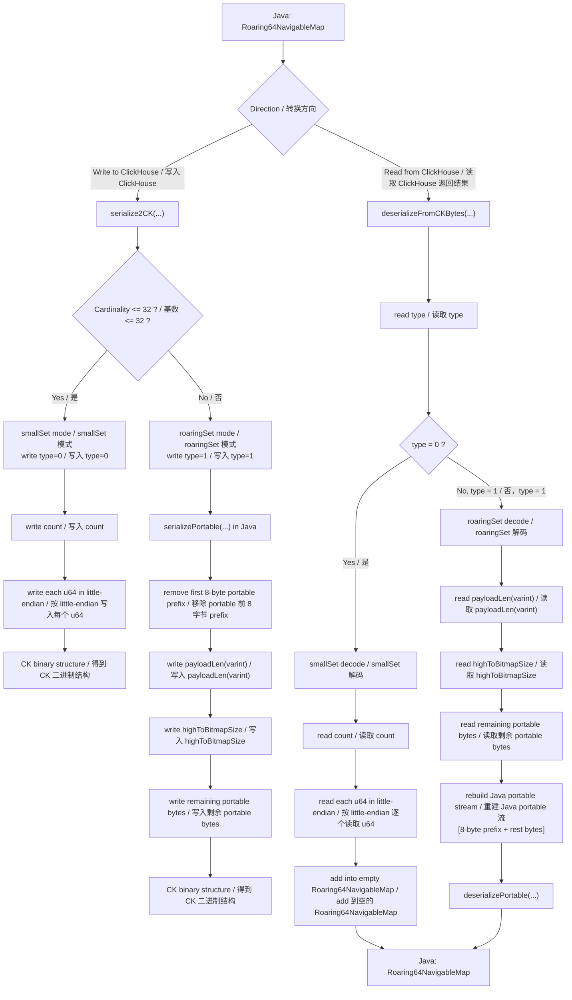
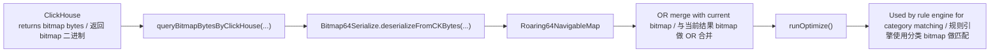

# Bitmap64Serialize: ClickHouse Bitmap and Java Roaring64 Compatibility Guide / ClickHouse Bitmap 与 Java Roaring64 兼容转换说明

## Background / 背景

In the real-time rule engine, we need to use bitmap data returned by ClickHouse for high-performance rule matching.

However, the binary format of ClickHouse bitmap is not fully compatible with the serialization protocol of Java `Roaring64NavigableMap`. A direct deserialization attempt may fail.

To solve this problem, the project implements `Bitmap64Serialize`, a compatibility component used for:

- parsing bitmap bytes returned by ClickHouse,
- reconstructing Java `Roaring64NavigableMap`,
- serializing Java bitmap objects into a ClickHouse-compatible format.

在实时规则引擎中，我们需要使用 ClickHouse 返回的 bitmap 数据进行高性能规则匹配。

但 ClickHouse bitmap 的二进制结构与 Java 侧 `Roaring64NavigableMap` 的序列化协议并不完全一致，直接反序列化会失败。

为了解决这个问题，项目中实现了 `Bitmap64Serialize` 组件，用于完成：

- ClickHouse bitmap 二进制结果解析
- Java `Roaring64NavigableMap` 重建
- Java bitmap 向 ClickHouse 格式的兼容写出

This component bridges the protocol gap between ClickHouse bitmap and Java bitmap objects, and provides the foundation for large-scale category bitmap matching in the rule engine.

该组件打通了 ClickHouse bitmap 与 Java bitmap 对象之间的跨系统兼容链路，为规则引擎中的大规模分类 bitmap 匹配提供了底层支持。

Core implementation file / 核心实现文件：

`src/main/java/com/glab/yd/tools/Bitmap64Serialize.java`

---

## Goals / 核心目标

The main goals of `Bitmap64Serialize` are:

1. Support both ClickHouse bitmap encodings:
   - `smallSet` (type = 0)
   - `roaringSet` (type = 1)
2. Handle cross-system binary protocol differences:
   - little-endian byte order
   - VarInt length field
   - Java portable bitmap prefix reconstruction
3. Reconstruct data into a unified Java object:
   - `Roaring64NavigableMap`

`Bitmap64Serialize` 的主要目标包括：

1. 兼容 ClickHouse bitmap 的两种编码格式
   - `smallSet`（type = 0）
   - `roaringSet`（type = 1）
2. 处理跨系统二进制协议差异
   - little-endian 字节序
   - VarInt 长度字段
   - Java portable bitmap prefix 重建
3. 在 Java 侧统一还原为 `Roaring64NavigableMap`

---

## End-to-End Flow / 总体流程图



---

## Runtime Read Path / 在线读取链路

The runtime read path in the rule engine is shown below:

规则引擎运行过程中的 bitmap 读取链路如下：



Actual usage in business code / 实际业务调用位置：

- `src/main/java/com/glab/yd/alarm/provider/ExternalProviders.java`
- After ClickHouse returns bitmap bytes, call `Bitmap64Serialize.deserializeFromCKBytes(bytes)`
- OR multiple batches together and then call `runOptimize()`

- `src/main/java/com/glab/yd/alarm/provider/ExternalProviders.java`
- 读取 ClickHouse bitmap 后调用 `Bitmap64Serialize.deserializeFromCKBytes(bytes)`
- 将多个批次结果 `or` 合并后再 `runOptimize()`

---

## Encoding Flow / 编码流程说明

### 1. Java object -> ClickHouse bitmap format / Java 对象写出为 ClickHouse bitmap 格式
Method entry / 方法入口：`serialize2CK(...)`

#### smallSet mode / smallSet 模式
When bitmap cardinality is small (`<= 32`), the `smallSet` layout is used:

- write `type = 0`
- write element count `count`
- write each `u64` value in little-endian

当 bitmap 基数较小（`<= 32`）时，采用 `smallSet` 格式：

- 写入 `type = 0`
- 写入元素个数 `count`
- 逐个按 little-endian 写入 `u64`

Structure / 结构：

```text
[type=0][count][u64][u64][u64]...
```

#### roaringSet mode / roaringSet 模式
When cardinality is larger, the `roaringSet` layout is used:

- write `type = 1`
- write `payloadLen(varint)`
- write `highToBitmapSize`
- call `serializePortable(...)` in Java first
- remove the first 8-byte portable prefix
- write the remaining portable bytes into ClickHouse structure

当 bitmap 基数较大时，采用 `roaringSet` 格式：

- 写入 `type = 1`
- 写入 `payloadLen(varint)`
- 写入 `highToBitmapSize`
- Java 侧先执行 `serializePortable(...)`
- 去掉 portable 字节流前 8 字节 prefix
- 将剩余字节写入 ClickHouse 结构

Structure / 结构：

```text
[type=1][payloadLen(varint)][highToBitmapSize][portable_bytes_without_prefix]
```

---

## Decoding Flow / 解码流程说明

### 2. ClickHouse result -> Java object / ClickHouse 返回结果还原为 Java 对象
Method entry / 方法入口：`deserializeFromCKBytes(...)`

#### smallSet decode / smallSet 解码
If `type = 0`:

- read `count`
- read each little-endian `u64`
- add them into an empty `Roaring64NavigableMap`

如果 `type = 0`：

- 读取 `count`
- 逐个读取 little-endian `u64`
- 依次 `add` 到空的 `Roaring64NavigableMap`

#### roaringSet decode / roaringSet 解码
If `type = 1`:

- read `payloadLen(varint)`
- read `highToBitmapSize`
- read remaining portable bytes
- rebuild a full Java portable stream:
  - `8-byte prefix + rest bytes`
- call `deserializePortable(...)` to reconstruct `Roaring64NavigableMap`

如果 `type = 1`：

- 读取 `payloadLen(varint)`
- 读取 `highToBitmapSize`
- 读取剩余 portable bytes
- 在 Java 侧重新构造完整 portable 流：
  - `8-byte prefix + rest bytes`
- 再调用 `deserializePortable(...)` 恢复成 `Roaring64NavigableMap`

---

## Key Compatibility Points / 关键兼容点

### 1. Two bitmap encodings / 两种 bitmap 类型兼容
The component must support both:

- `smallSet`
- `roaringSet`

组件需要同时兼容：

- `smallSet`
- `roaringSet`

because ClickHouse may choose different encodings at different cardinalities.

因为 ClickHouse 在不同基数下会选择不同 bitmap 编码方式。

### 2. Byte order / 字节序差异
ClickHouse bitmap uses little-endian byte order, so both encoding and decoding must explicitly set:

```java
ByteBuffer.order(ByteOrder.LITTLE_ENDIAN)
```

ClickHouse bitmap 使用 little-endian 编码，因此在解析和写出过程中都需要显式指定：

```java
ByteBuffer.order(ByteOrder.LITTLE_ENDIAN)
```

### 3. VarInt payload length / VarInt 长度字段处理
In `roaringSet` mode, payload length is encoded using VarInt and must be parsed explicitly.

在 `roaringSet` 模式中，payload 长度使用 VarInt 编码，需要显式解析。

### 4. Java portable prefix reconstruction / Java portable prefix 重建
Java `Roaring64NavigableMap` portable bytes and ClickHouse bitmap bytes are not directly identical:

- Java portable stream contains the first 8-byte prefix
- ClickHouse bitmap returns `highToBitmapSize` separately
- decoding must rebuild the prefix before `deserializePortable(...)`

Java `Roaring64NavigableMap` 的 portable 序列与 ClickHouse 返回结构之间存在 prefix 差异：

- Java portable 流包含前 8 字节 prefix
- ClickHouse bitmap 返回时拆出了 `highToBitmapSize`
- 解码时必须重新拼回前缀，才能正常 `deserializePortable(...)`

---

## Key Methods / 关键方法一览

### Java -> ClickHouse
- `serialize2CK(...)`

### Java -> Java portable bytes
- `serialize2Java(...)`

### ClickHouse Base64 -> Java
- `deserializeFromCKBase64(...)`

### ClickHouse bytes -> Java
- `deserializeFromCKBytes(...)`

### Java portable bytes -> Java
- `deserializeFromJava(...)`

---

## Business Value / 业务价值

With `Bitmap64Serialize`, the platform gains the following capabilities:

- bridge the protocol gap between ClickHouse bitmap and Java bitmap objects
- support efficient loading of large-scale category bitmap data in the rule engine
- avoid deserialization failures caused by incompatible binary formats
- provide a stable low-level data structure for real-time risk rule matching

通过 `Bitmap64Serialize`，平台获得了以下能力：

- 打通 ClickHouse bitmap 与 Java bitmap 对象之间的跨系统兼容链路
- 支撑规则引擎高效加载大规模分类 bitmap
- 避免因二进制协议不一致导致的反序列化失败
- 为实时风控规则匹配提供稳定的底层数据结构支持

---

## Summary / 总结

`Bitmap64Serialize` is not just a simple serialization utility. It is a cross-system bitmap protocol adapter.

It solves the incompatibility between ClickHouse bitmap binary format and Java `Roaring64NavigableMap` serialization protocol, and provides the foundation for using large-scale bitmap data inside the real-time rule engine.

`Bitmap64Serialize` 不是简单的序列化工具，而是一个跨系统 bitmap 协议适配组件。

它解决了 ClickHouse bitmap 返回结果与 Java `Roaring64NavigableMap` 序列化协议不一致的问题，为平台在实时规则引擎中使用大规模 bitmap 数据提供了基础能力支撑。
